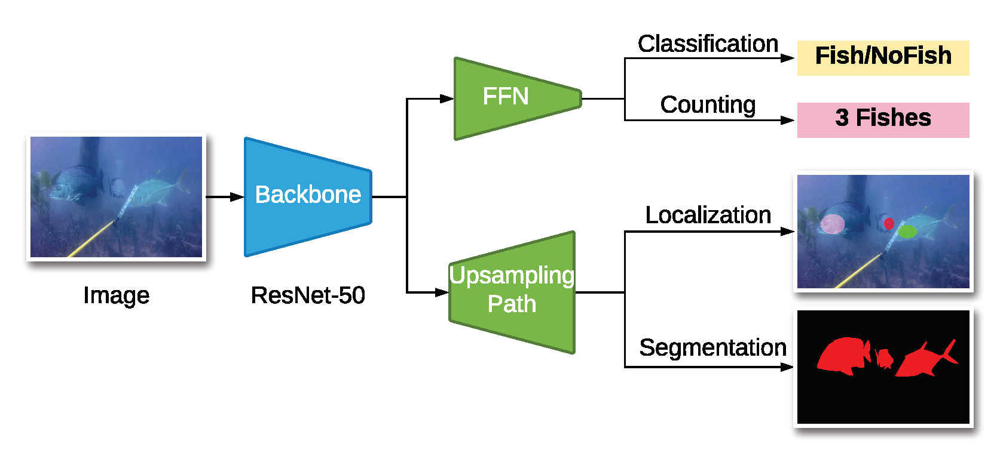

## DeepFish (A Realistic Fish-Habitat Dataset to Evaluate Algorithms for Underwater Visual Analysis) 

### Accepted at Nature Scientific Reports [[Paper]](https://www.nature.com/articles/s41598-020-71639-x) [[Dataset]](https://cloudstor.aarnet.edu.au/plus/s/NfjObIhtUYO6332)  [[Project]](https://alzayats.github.io/DeepFish/) 


 
 

## To install DeepFish as a Python package for access outside the repo:
`python setup.py install` OR `pip install -e .`

## Install requirements
`pip install -r requirements.txt` 

`pip install git+https://github.com/ElementAI/LCFCN`

## Download

*  Download the DeepFish dataset from [here](http://data.qld.edu.au/public/Q5842/2020-AlzayatSaleh-00e364223a600e83bd9c3f5bcd91045-DeepFish/)

## 1. Train and test on single image

### Localization
```
python scripts/train_single_image.py -e loc -d ${PATH_TO_DATASET}
```

This outputs the following image 


### Segmentation

```
python scripts/train_single_image.py -e seg -d ${PATH_TO_DATASET}
```

This outputs the following image 


## 2. Train and test on the dataset

Run the following command to reproduce the experiments in the paper:

`python trainval.py -e ${TASK} -sb ${SAVEDIR_BASE} -d ${DATADIR} -r 1`

The variables (`${...}`) can be substituted with the following values:

* `TASK` : loc, seg, clf, reg
* `SAVEDIR_BASE`: Absolute path to where results will be saved
* `DATADIR`: Absolute path containing the downloaded datasets

Experiment hyperparameters are defined in `exp_configs.py`

## Citations

If you use the DeepFish dataset in your work, please cite it as:

```
@article{saleh2020realistic,
  title={A realistic fish-habitat dataset to evaluate algorithms for underwater visual analysis},
  author={Saleh, Alzayat and Laradji, Issam H and Konovalov, Dmitry A and Bradley, Michael and Vazquez, David and Sheaves, Marcus},
  journal={Scientific Reports},
  volume={10},
  number={1},
  pages={14671},
  year={2020},
  publisher={Nature Publishing Group UK London},
  doi={https://doi.org/10.1038/s41598-020-71639-x}
}
```
